# Design Class Diagram

## Metadata
| Key | Value |
| --- | --- |
| ID | DCD-002 |
| CrossReference | [DCD-001], [DCD-003], [DM-002], [UC-001], [UC-002], [OC-001], [SD-001], [SD-002], [DICT-001] |

## Version History
| Date | Status | Author | Reviewer | Change | Commit |
| --- | --- | --- | --- | --- | --- |
| 2026-10-07 | Proposed | Jens Tirsvad Nielsen | S02 | Added Launcher, Checkout and WorkingFolder; startProjectCreation takes the checkout and working folder (from DCD-003, UC-002) | [1cd27f7] |
| 2026-10-07 | Proposed | Jens Tirsvad Nielsen | S02 | Default configuration files: --config and --env, else ./config.env and ./.env in the working folder, else the checkout's | [0ab5006] |

---

## Purpose and Scope

The consolidated design model of the project. Use-case models are scoped views; when one changes, this model is checked and updated in the same change. It currently covers [UC-001] "Create a new project" ([DCD-001]), which it was created from, and refines the concepts of [DM-002]. Class and attribute names are the IT terms of [DICT-001]. Every method traces to a contract in [OC-001] or a message in [SD-001].

The classes are design classes of a Bash program: a class is a group of functions in `src/lib/` with its data held in the shared state arrays (see "Implementation Mapping").

## Diagram

```plantuml
@startuml
skinparam classAttributeIconSize 0
hide empty members

enum Visibility {
  private
  public
}

class ProjectCreator <<controller>> {
  +startProjectCreation(workingFolder : WorkingFolder, configFiles : ConfigFiles) : PromptSet
  +provideProjectDetails(name : String, description : String, visibility : Visibility, giteaOwner : Owner, githubOwner : Owner [0..1], directory : Path, enablePlanGate : Boolean, writeEnvFile : Boolean) : Summary
}
class ConfigLoader {
  +load(configFile : Path, envFile : Path) : Configuration
}
class CredentialCollector {
  +collect(configuration : Configuration, kinds : String [1..3]) : Configuration
}
class EnvFileWriter {
  +write(project : LocalProject, configuration : Configuration, hasGithub : Boolean) : EnvFile [0..1]
}
class ToolChecker {
  +check(tools : String [1..*]) : ToolCheck
}
class Preflight {
  +check(request : ProjectRequest) : PreflightResult
}
abstract class GitHost <<facade>> {
  -name : String
  -webAddress : String
  -apiAddress : String
  +verifyToken() : Boolean
  +ownerAccepts(owner : Owner) : Boolean
  +nameFree(name : String) : Boolean
}
class GiteaClient <<facade>> {
  +GiteaClient(configuration : Configuration)
  +hasLicense(key : String) : Boolean
  +createRepository(request : ProjectRequest, license : String [0..1]) : GiteaRepository
  +addPushMirror(source : GiteaRepository, target : GitHubRepository) : PushMirror
  -requestSync(mirror : PushMirror) : void
}
class GitHubClient <<facade>> {
  +GitHubClient(configuration : Configuration)
  +createEmptyRepository(request : ProjectRequest) : GitHubRepository
}
class LocalProjectBuilder {
  +build(directory : Path, source : GiteaRepository, target : GitHubRepository [0..1], sshPassed : Boolean) : LocalProject
}
class FrameworkInstaller {
  +install(project : LocalProject, enablePlanGate : Boolean) : InstallResult
}
class SummaryReport {
  +compose(request : ProjectRequest) : Summary
}

class Launcher {
  +resolveCheckout(invocation : Path) : Checkout
  +currentFolder() : WorkingFolder
  +locateConfigFiles(configPath : Path [0..1], envPath : Path [0..1], checkout : Checkout, workingFolder : WorkingFolder) : ConfigFiles
  +startFromWorkingFolder(configPath : Path [0..1], envPath : Path [0..1]) : PromptSet
}
class Checkout {
  -path : Path
  +configFile() : Path
  +envFile() : Path
}
class WorkingFolder {
  -path : Path
  +configFile() : Path [0..1]
  +envFile() : Path [0..1]
}
class ConfigFiles {
  -configFile : Path
  -envFile : Path
}
class Run {
  -isApply : Boolean
}
class Configuration {
  -giteaUrl : String
  -giteaApiUrl : String
  -githubWebUrl : String
  -githubApiUrl : String
  -giteaSshPort : Integer
  -mirrorInterval : String
  -frameworkRepo : String
  -presetDetails : Map [0..1]
}
class Credential {
  -kind : String
  -value : String
}
class ToolCheck {
  -hasGit : Boolean
  -hasCurl : Boolean
  -hasJq : Boolean
}
class PromptSet {
  -prompts : String [1..*]
}
class ProjectRequest {
  -name : String
  -description : String
  -visibility : Visibility
  -directory : Path
  -enablePlanGate : Boolean
  -license : String [0..1]
}
class Owner {
  -name : String
  -kind : String
}
class PreflightResult {
  -tokensWork : Boolean
  -ownersAccept : Boolean
  -nameIsFree : Boolean
  -licenseIsOffered : Boolean
  -sshPassed : Boolean
}
abstract class Repository {
  -name : String
  -description : String
  -visibility : Visibility
  -address : String
}
class GiteaRepository
class GitHubRepository
class LicenseFile {
  -key : String
}
class PushMirror {
  -interval : String
  -syncOnCommit : Boolean
}
class LocalProject {
  -directory : Path
}
class Remote {
  -name : String
  -address : String
}
class Submodule {
  -name : String
  -address : String
}
class HookSetup {
  -areSkillsInstalled : Boolean
  -areHooksInstalled : Boolean
  -isPlanGateEnabled : Boolean
}
class EnvFile {
  -address : Path
  -keys : String [1..3]
}
class Template {
  -name : String
  -isCopied : Boolean
}
class InstallResult <<dto>>
class Summary {
  -createdItems : String [0..*]
  -skippedItems : String [0..*]
  -nextSteps : String [0..*]
}

Launcher "1" --> "1" ProjectCreator : starts
Launcher ..> Checkout : creates
Launcher ..> WorkingFolder : creates
Launcher ..> ConfigFiles : creates
Run "1" *-- "1" ConfigFiles
Run "1" *-- "1" Checkout
Run "1" *-- "1" WorkingFolder
ProjectCreator ..> ConfigLoader : creates
ProjectCreator ..> ToolChecker : creates
ProjectCreator ..> CredentialCollector : creates
ProjectCreator ..> EnvFileWriter : creates [0..1]
ProjectCreator ..> Preflight : creates
ProjectCreator ..> GiteaClient : creates
ProjectCreator ..> GitHubClient : creates [0..1]
ProjectCreator ..> LocalProjectBuilder : creates
ProjectCreator ..> FrameworkInstaller : creates
ProjectCreator ..> SummaryReport : creates
Preflight ..> GiteaClient : asks
Preflight ..> GitHubClient : asks [0..1]
GitHost <|-- GiteaClient
GitHost <|-- GitHubClient
GitHost "1" --> "0..*" Owner : has
GiteaClient ..> Configuration
GitHubClient ..> Configuration

ProjectCreator "0..*" --> "1" Run
Run "1" *-- "1" Configuration
Run "1" *-- "1" ToolCheck
Run "1" *-- "0..1" ProjectRequest
Run "1" --> "1" PromptSet : returns
Configuration "1" *-- "1..3" Credential

ProjectRequest "0..*" --> "1" Owner : giteaOwner
ProjectRequest "0..*" --> "0..1" Owner : githubOwner
ProjectRequest "1" *-- "0..1" PreflightResult
ProjectRequest "1" --> "0..1" GiteaRepository : stored in
ProjectRequest "1" --> "0..1" GitHubRepository : also stored in
ProjectRequest "1" --> "0..1" LocalProject : working copy
Summary "0..*" --> "1" ProjectRequest : reports on

Repository <|-- GiteaRepository
Repository <|-- GitHubRepository
Repository "0..*" --> "1" Owner : owned by
GiteaRepository "1" *-- "0..1" LicenseFile
PushMirror "0..*" --> "1" GiteaRepository : source
PushMirror "0..*" --> "1" GitHubRepository : target
PushMirror "0..*" --> "1" Credential : authorised by

LocalProject "1" *-- "1..2" Remote
Remote "0..*" --> "1" Repository : points to
LocalProject "1" *-- "1" Submodule
LocalProject "1" *-- "1" HookSetup
LocalProject "1" *-- "0..*" Template
LocalProject "1" *-- "0..1" EnvFile
EnvFile "0..*" --> "1..3" Credential : copy of
InstallResult "0..*" --> "1" Submodule
InstallResult "0..*" --> "1" HookSetup
InstallResult "0..*" --> "0..*" Template

ProjectRequest "0..*" --> "1" Visibility
Repository "0..*" --> "1" Visibility
@enduml
```

## Class Table

| Class | Refines (Domain Model concept) | Responsibility | Attributes | Operations |
| --- | --- | --- | --- | --- |
| `Launcher` | Command Link (the object that follows it) | Follows the command link to the checkout, takes the folder the Maintainer stands in, chooses the two configuration files, and starts the run. | none | `resolveCheckout`, `currentFolder`, `locateConfigFiles`, `startFromWorkingFolder` |
| `Checkout` | Checkout | Names the folder that holds the script's own files and the default `config.env` and `.env`. | `path` | `configFile`, `envFile` |
| `WorkingFolder` | Working Folder | Names the base of the default directory of the new project and the files it may hold. | `path` | `configFile`, `envFile` |
| `ConfigFiles` | none (system concept of [OC-002]) | Carries the two files chosen for the `Configuration`. | `configFile`, `envFile` | none |
| `ProjectCreator` | none (controller for the system operations of [OC-001]) | Receives the two system operations, sequences the steps and stops on the first failure. | none | `startProjectCreation`, `provideProjectDetails` |
| `ConfigLoader` | Configuration | Reads `config.env` and `.env` as plain text and validates every value, preset project details included. | none | `load` |
| `CredentialCollector` | none (system concept) | Asks, without echo, for a credential that `.env` does not provide and validates it like one read from `.env`. | none | `collect` |
| `EnvFileWriter` | Credentials File | Creates the project's own `.env` with the credentials the project needs: owner-only, excluded from git, never replaced without a yes. | none | `write` |
| `ToolChecker` | none (system concept `ToolCheck`) | Detects the required and optional tools. | none | `check` |
| `Preflight` | none (system concept `PreflightResult`) | Runs the read-only checks of both hosts before anything is created. | none | `check` |
| `GitHost` | Git Host | The operations every host offers: check the token, check that an owner accepts new repositories, check that a name is free. | `name`, `webAddress`, `apiAddress` | `verifyToken`, `ownerAccepts`, `nameFree` |
| `GiteaClient` | Git Host (Gitea) | Hides the Gitea API and its token; creates the repository and the push mirror. | none beyond `GitHost` (uses `Configuration`) | `GiteaClient`, `hasLicense`, `createRepository`, `addPushMirror`, `requestSync` |
| `GitHubClient` | Git Host (GitHub) | Hides the GitHub API and its token; creates the empty repository. | none beyond `GitHost` (uses `Configuration`) | `GitHubClient`, `createEmptyRepository` |
| `LocalProjectBuilder` | Local Project, Remote | Creates the project directory, its git repository and its credential-free remotes. | none | `build` |
| `FrameworkInstaller` | Framework, Framework Setup, Template | Adds the framework submodule, installs skills and hooks once, and copies the templates without overwriting. | none | `install` |
| `SummaryReport` | Summary | Composes the report of what was created, skipped or failed. | none | `compose` |
| `Run` | none (system concept) | Holds the state of one execution. | `isApply` | none |
| `Configuration` | Configuration | Holds the service addresses, the credentials and any preset project details. | `giteaUrl`, `giteaApiUrl`, `githubWebUrl`, `githubApiUrl`, `giteaSshPort`, `mirrorInterval`, `frameworkRepo`, `presetDetails` | none |
| `Credential` | Access Token | Holds a secret in memory only; it never becomes part of an address or a message. | `kind`, `value` | none |
| `ToolCheck` | none (system concept) | Records which tools are present. | `hasGit`, `hasCurl`, `hasJq` | none |
| `PromptSet` | none (system concept) | The questions still to ask; a detail preset in `config.env` is not in it. | `prompts` | none |
| `ProjectRequest` | Project | Holds the details of the project being created. | `name`, `description`, `visibility`, `directory`, `enablePlanGate`, `license` | none |
| `Owner` | Owner | A user or organization on a host. | `name`, `kind` | none |
| `PreflightResult` | none (system concept) | Records the outcome of the preflight checks. | `tokensWork`, `ownersAccept`, `nameIsFree`, `licenseIsOffered`, `sshPassed` | none |
| `Repository` | Repository | Common data of a repository on a host. | `name`, `description`, `visibility`, `address` | none |
| `GiteaRepository` | Gitea Repository | The source of truth. | none beyond `Repository` | none |
| `GitHubRepository` | GitHub Repository | Receives its content from the mirror. | none beyond `Repository` | none |
| `LicenseFile` | License | The license file in the Gitea repository when a license applies. | `key` | none |
| `PushMirror` | Mirror | The Gitea to GitHub push mirror. | `interval`, `syncOnCommit` | none |
| `LocalProject` | Local Project | The project directory on the Maintainer's machine. | `directory` | none |
| `Remote` | Remote | A named link to a repository (`origin`, `github`), without a credential. | `name`, `address` | none |
| `Submodule` | Framework | The framework added to the local project. | `name`, `address` | none |
| `HookSetup` | Framework Setup | Records the skills and hooks installed and the plan gate state. | `areSkillsInstalled`, `areHooksInstalled`, `isPlanGateEnabled` | none |
| `EnvFile` | Credentials File | The `.env` of the project: a copy of the credentials it needs. | `address`, `keys` | none |
| `Template` | Template | A framework file copied into the project. | `name`, `isCopied` | none |
| `InstallResult` | none (carries the result of one operation) | Returns the submodule, the hook setup and the templates of `install`. | none | none |
| `Summary` | Summary | The report returned to the Maintainer; it contains no credential. | `createdItems`, `skippedItems`, `nextSteps` | none |
| `Visibility` | none (enumeration of a Project and Repository attribute) | The two allowed visibilities. | `private`, `public` | none |

## Method Traceability

| Method signature | Operation Contract / SD message |
| --- | --- |
| `ProjectCreator.startProjectCreation(workingFolder, configFiles) : PromptSet` | [OC-001] `startProjectCreation`; [SD-001] `startProjectCreation()`; [SD-002] `startProjectCreation(checkout, workingFolder, ...)` |
| `Launcher.startFromWorkingFolder(configPath, envPath) : PromptSet` | [OC-002] `startFromWorkingFolder`; [SD-002] |
| `Launcher.resolveCheckout(invocation) : Checkout`, `Launcher.currentFolder() : WorkingFolder` | [OC-002] P2, P3; [SD-002] |
| `Launcher.locateConfigFiles(configPath, envPath, checkout, workingFolder) : ConfigFiles`, `WorkingFolder.configFile()`, `WorkingFolder.envFile()` | [OC-002] P5; [SD-002] `locateConfigFiles(...)` |
| `ProjectCreator.provideProjectDetails(name, description, visibility, giteaOwner, githubOwner, directory, enablePlanGate, writeEnvFile) : Summary` | [OC-001] `provideProjectDetails`; [SD-001] `provideProjectDetails(...)` |
| `ConfigLoader.load(configFile, envFile) : Configuration` | [SD-001] `load(config.env, .env)`; [OC-001] `startProjectCreation` P2 |
| `CredentialCollector.collect(configuration, kinds) : Configuration` | [SD-001] `collect(configuration, GITEA_TOKEN)` and `collect(configuration, GITHUB_PAT, GITHUB_USER)`; [OC-001] `startProjectCreation` P2 and the precondition of `provideProjectDetails` |
| `EnvFileWriter.write(project, configuration, hasGithub) : EnvFile` | [SD-001] `write(localProject, configuration, githubOwner present)`; [OC-001] `provideProjectDetails` P14 |
| `ToolChecker.check(tools) : ToolCheck` | [SD-001] `check(git, curl, jq)`; [OC-001] `startProjectCreation` P3 |
| `Preflight.check(request) : PreflightResult` | [SD-001] `check(request)`; [OC-001] `provideProjectDetails` P2 |
| `GiteaClient(configuration)` | [SD-001] `new(configuration)` to `GiteaClient` |
| `GitHost.verifyToken() : Boolean` | [SD-001] `verifyToken()` from `Preflight` to either client; P2 |
| `GitHost.ownerAccepts(owner) : Boolean` | [SD-001] `ownerAccepts(giteaOwner)` and `ownerAccepts(githubOwner)`; P2 |
| `GitHost.nameFree(name) : Boolean` | [SD-001] `nameFree(name)` to either client; P2 |
| `GiteaClient.hasLicense(key) : Boolean` | [SD-001] `hasLicense(license)`; P2 |
| `GiteaClient.createRepository(request, license) : GiteaRepository` | [SD-001] `createRepository(request, license)`; P3, P4 |
| `GiteaClient.addPushMirror(source, target) : PushMirror` | [SD-001] `addPushMirror(giteaRepository, gitHubRepository)`; P6 |
| `GiteaClient.requestSync(mirror) : void` | [SD-001] `requestSync(pushMirror)`; P6 |
| `GitHubClient(configuration)` | [SD-001] `new(configuration)` to `GitHubClient` |
| `GitHubClient.createEmptyRepository(request) : GitHubRepository` | [SD-001] `createEmptyRepository(request)`; P5 |
| `LocalProjectBuilder.build(directory, source, target, sshPassed) : LocalProject` | [SD-001] `build(directory, giteaRepository, gitHubRepository, sshPassed)`; P7, P8, P9 |
| `FrameworkInstaller.install(project, enablePlanGate) : InstallResult` | [SD-001] `install(localProject, enablePlanGate)`; P10, P11, P12 |
| `SummaryReport.compose(request) : Summary` | [SD-001] `compose(projectRequest)`; P13 |

## Pattern Annotations

| Pattern | Classes | Rationale |
| --- | --- | --- |
| Controller (GRASP) | `ProjectCreator` | One entry for the system operations; coordinates and does no HTTP, git or file work itself |
| Facade (GoF) | `GitHost`, `GiteaClient`, `GitHubClient` | Each client hides one host's HTTP API and keeps the token inside; no other class sees a credential. `GitHost` holds the operations both share |
| Pure Fabrication (GRASP) | `ConfigLoader`, `ToolChecker`, `CredentialCollector`, `EnvFileWriter`, `Preflight`, `LocalProjectBuilder`, `FrameworkInstaller`, `SummaryReport` | No domain concept owns these responsibilities; small units keep cohesion high |
| Creator (GRASP) | `ConfigLoader` creates `Configuration`; `GiteaClient` creates `GiteaRepository` and `PushMirror` | The creating class holds the data needed to build the object |
| Protection from variations (GRASP) | `GiteaClient`, `GitHubClient`, `ProjectRequest` | The optional GitHub path is decided by the controller; the clients do not know it |
| Data Transfer Object (GoF-style) | `InstallResult` | Carries the three results of `install` in one return value |

## Dependency Check

No circular dependency. `ProjectCreator` depends on every helper class and no helper depends on it. `Preflight` depends on the two clients; the clients extend `GitHost` and depend only on `Configuration`. The data classes form a tree: `Run` holds `Configuration`, `ToolCheck` and `ProjectRequest`; `ProjectRequest` reaches the repositories and the `LocalProject`; `Summary` points at `ProjectRequest` and nothing points back at it. `CredentialCollector` and `EnvFileWriter` depend only on `Configuration`, `Credential` and `LocalProject`; the only class that holds a secret after the run is `EnvFile`, and only as a copy written to the Maintainer's own disk. `Repository` is shared by `Remote` and `PushMirror` without a cycle.

SOLID check: no class has more than one reason to change (one host API, one kind of local work, one report); the clients can be replaced behind the same operations; the controller depends on the operations, not on how a host or git is called. `ProjectCreator` has two operations and no data, so it is not a god class.

## Implementation Mapping

| Design class | Where it lives in `src/` |
| --- | --- |
| `Launcher` | `create-project.sh` (the start of `main`: where the script finds its own folder) |
| `ProjectCreator` | `create-project.sh` (`main`), `lib/apply.sh` |
| `ConfigLoader` | `lib/config.sh` (`load_configuration`), `lib/validate.sh` |
| `ToolChecker` | `lib/tools.sh` |
| `CredentialCollector` | planned for [MIL-005]: `lib/credentials.sh`, with `lib/prompts.sh` |
| `EnvFileWriter` | planned for [MIL-005]: `lib/envfile.sh` |
| `Preflight` | `lib/preflight.sh` |
| `GitHost`, `GiteaClient`, `GitHubClient` | `lib/api.sh`, `lib/http.sh`, `lib/json.sh`, `lib/repositories.sh`, `lib/mirror.sh`, `lib/hosts.sh` |
| `LocalProjectBuilder` | `lib/localproject.sh`, `lib/git.sh` |
| `FrameworkInstaller` | `lib/framework.sh` |
| `SummaryReport` | `lib/steps.sh`, `lib/plan.sh` |
| `PromptSet`, `ProjectRequest` | `lib/project.sh`, `lib/prompts.sh` |
| `Run`, `Configuration`, `Credential`, `PreflightResult` | the state arrays declared in `lib/constants.sh` |

---

[DCD-001]: ./uc-001/dcd.md
[DCD-003]: ./uc-002/dcd.md
[UC-002]: ./uc-002/uc.md
[SD-002]: ./uc-002/sd.md
[OC-002]: ./uc-002/oc.md
[DM-002]: ./domain-model.md
[UC-001]: ./uc-001/uc.md
[OC-001]: ./uc-001/oc.md
[SD-001]: ./uc-001/sd.md
[MIL-005]: ./milestones/mil-005-credentials.md
[DICT-001]: ./dictionary.md
[1cd27f7]: https://git.tirsystem.com/TirSystem-BashScript/repo_foundry/commit/1cd27f77ed844773a969210a11de0d8bb98ac98f
[0ab5006]: https://git.tirsystem.com/TirSystem-BashScript/repo_foundry/commit/0ab50068bf9e5be82a801af9dbe5b763eeaf7f31
