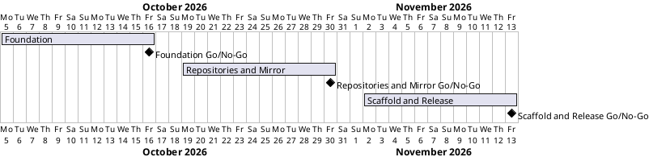

# Project Plan

## Metadata
| Key | Value |
| --- | --- |
| ID | PP-001 |
| CrossReference | [BC-001], [SA-001], [MIL-001], [MIL-002], [MIL-003], [US-001] |

## Version History
| Date | Status | Author | Reviewer | Change | Commit |
| --- | --- | --- | --- | --- | --- |
| 2026-10-05 | Proposed | Jens Tirsvad Nielsen | S02 | Initial version | [424f14f] |

---

## Purpose

Schedule the three phases that deliver RepoFoundry (`create-project.sh` and its documentation) in dependency order. The Business Case sets no deadline, so the dates below are proposals for S01 to confirm.

## Planning Assumptions

- Week 1 starts 2026-10-05; the plan ends by 2026-11-13.
- Phase length: two weeks.
- S01 and S02 review each phase through a pull request, as described in [SA-001]. For now one person holds both roles.
- The PO language is English, so no translated copies are kept.

## Gateway Schedule

| Gateway | Document | Window | Decision date | Owner | Stories | Main deliverable | Milestone |
| --- | --- | --- | --- | --- | --- | --- | --- |
| Foundation | [MIL-001] | 2026-10-05 to 2026-10-16 | 2026-10-16 | S01 | US-001.01 | Safe skeleton, config parsing, prompts, tests | |
| Repositories and Mirror | [MIL-002] | 2026-10-19 to 2026-10-30 | 2026-10-30 | S02 | US-001.01 | GitHub and Gitea repositories and the push mirror | |
| Scaffold and Release | [MIL-003] | 2026-11-02 to 2026-11-13 | 2026-11-13 | S01 | US-001.01 | Local project, framework, README, final review | |



## Scope Coverage

| Business Case scope item | Gateway |
| --- | --- |
| Safe parsing of `config.env` and `.env`, tool checks, prompts, `.gitignore` | [MIL-001] |
| Project name check on GitHub | [MIL-001] |
| Creation of both repositories and the push mirror | [MIL-002] |
| Partial-failure reporting | [MIL-002] |
| Local directory, remotes, framework submodule, skills, hooks, templates, plan gate | [MIL-003] |
| README and SSH prerequisite documentation | [MIL-003] |

## Dependencies

```
MIL-001 → MIL-002 → MIL-003
```

A No-Go moves every later date by the time needed to rework the failed criteria.

## Plan Risks

| Risk | Impact | Mitigation |
| --- | --- | --- |
| No disposable GitHub organization for testing | Organization-owner path untested | Agree the test owners before [MIL-002] starts |
| Gitea API behaviour differs from the swagger on the live server | Mirror task takes longer | Test against `git.tirsystem.com` early in [MIL-002] |

## Open Issues

- Confirm the proposed dates (S01).
- Decided: `origin` uses HTTPS derived from `GITEA_URL`, unless the SSH test passed, in which case it uses SSH on port 10022.
- Decided: use case [UC-001] "Create a new project" is created, with [SSD-001]; tasks that implement its steps reference it.
- Decided: S01 and S02 are both held by one person for now.
- Open: this plan says the script does not make the first commit; confirm.

---

[BC-001]: ./business-case.md
[SA-001]: ./stakeholder-analysis.md
[MIL-001]: ./milestones/mil-001-foundation.md
[MIL-002]: ./milestones/mil-002-repositories-and-mirror.md
[MIL-003]: ./milestones/mil-003-scaffold-and-release.md
[US-001]: ./user-stories.md
[UC-001]: ./uc-001/uc.md
[SSD-001]: ./uc-001/ssd.md
[424f14f]: https://git.tirsystem.com/TirSystem-BashScript/repo_foundry/commit/424f14f4f5577bb47fea41c8f3a655dca953e6d8
