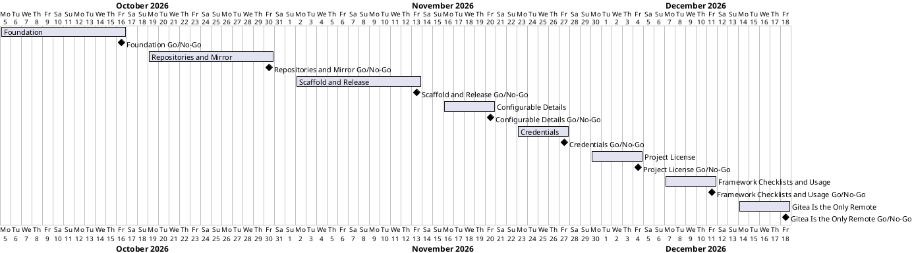

# Project Plan

## Metadata
| Key | Value |
| --- | --- |
| ID | PP-001 |
| CrossReference | [BC-001], [SA-001], [MIL-001], [MIL-002], [MIL-003], [MIL-004], [MIL-005], [MIL-006], [MIL-007], [MIL-008], [US-001] |

## Version History
| Date | Status | Author | Reviewer | Change | Commit |
| --- | --- | --- | --- | --- | --- |
| 2026-10-07 | Deprecated | Jens Tirsvad Nielsen | S02 | Added phase MIL-007 (proposed dates 2026-12-07 to 2026-12-11); MIL-006 deliverable names the public-only AGPL-3.0 default | [1cd27f7] |
| 2026-10-08 | Accepted | Jens Tirsvad Nielsen | S02 | Added phase MIL-008 (proposed dates 2026-12-14 to 2026-12-18): the local project has origin as its only remote | [039a28c] |

---

## Purpose

Schedule the eight phases that deliver RepoFoundry (`create-project.sh` and its documentation) in dependency order. The Business Case sets no deadline, so the dates below are proposals for S01 to confirm.

## Planning Assumptions

- Week 1 starts 2026-10-05; the plan ends by 2026-12-18 (the last three phases are proposed).
- Phase length: two weeks.
- S01 and S02 review each phase through a pull request, as described in [SA-001]. For now one person holds both roles.
- The PO language is English, so no translated copies are kept.

## Gateway Schedule

| Gateway | Document | Window | Decision date | Owner | Stories | Main deliverable | Milestone |
| --- | --- | --- | --- | --- | --- | --- | --- |
| Foundation | [MIL-001] | 2026-10-05 to 2026-10-16 | 2026-10-16 | S01 | US-001.01 | Safe skeleton, config parsing, prompts, tests | [Milestone 43] |
| Repositories and Mirror | [MIL-002] | 2026-10-19 to 2026-10-30 | 2026-10-30 | S02 | US-001.02 | GitHub and Gitea repositories and the push mirror | [Milestone 44] |
| Scaffold and Release | [MIL-003] | 2026-11-02 to 2026-11-13 | 2026-11-13 | S01 | US-001.03 | Local project, framework, README, final review | [Milestone 45] |
| Configurable Details | [MIL-004] | 2026-11-16 to 2026-11-20 | 2026-11-20 | S01 | US-001.04 | Project details preset in config.env | |
| Credentials | [MIL-005] | 2026-11-23 to 2026-11-27 | 2026-11-27 | S01 | US-001.05 | Missing credentials asked; project .env | |
| Project License | [MIL-006] | 2026-11-30 to 2026-12-04 | 2026-12-04 | S01 | US-001.06 | PROJECT_LICENSE in config.env; AGPL-3.0 default only for a public GitHub project | |
| Framework Checklists and Usage | [MIL-007] | 2026-12-07 to 2026-12-11 | 2026-12-11 | S01 | US-001.07 | qc fetched with the framework; global command; README usage | |
| Gitea Is the Only Remote | [MIL-008] | 2026-12-14 to 2026-12-18 | 2026-12-18 | S01 | US-001.03 | The local project has `origin` only; GitHub is reached through the mirror | |



## Scope Coverage

| Business Case scope item | Gateway |
| --- | --- |
| Safe parsing of `config.env` and `.env`, tool checks, prompts, `.gitignore` | [MIL-001] |
| Project name check on GitHub | [MIL-001] |
| Creation of both repositories and the push mirror | [MIL-002] |
| Partial-failure reporting | [MIL-002] |
| Local directory, remotes, framework submodule, skills, hooks, templates, plan gate | [MIL-003] |
| README and SSH prerequisite documentation | [MIL-003] |
| Project details set in `config.env` instead of asked | [MIL-004] |
| Missing credentials asked; the new project's `.env` | [MIL-005] |
| Project license set in `config.env` | [MIL-006] |
| Framework's own submodules fetched | [MIL-007] |
| README usage from the target folder and as a global command | [MIL-007] |
| The local project has `origin` as its only remote | [MIL-008] |

## Dependencies

```
MIL-001 → MIL-002 → MIL-003 → MIL-004 → MIL-005 → MIL-006 → MIL-007 → MIL-008
```

A No-Go moves every later date by the time needed to rework the failed criteria.

## Plan Risks

| Risk | Impact | Mitigation |
| --- | --- | --- |
| No disposable GitHub organization for testing | Organization-owner path untested | Agree the test owners before [MIL-002] starts |
| Gitea API behaviour differs from the swagger on the live server | Mirror task takes longer | Test against `git.tirsystem.com` early in [MIL-002] |

## Open Issues

- Decided: the proposed dates are accepted with this plan (S01 asked for its acceptance on 2026-10-05); a change needs a new Version History row.
- Decided: `origin` uses HTTPS derived from `GITEA_URL`, unless the SSH test passed, in which case it uses SSH on port 10022.
- Decided: use case [UC-001] "Create a new project" is created, with [SSD-001]; tasks that implement its steps reference it.
- Decided: S01 and S02 are both held by one person for now.
- Open: this plan says the script does not make the first commit; confirm before MIL-003 starts.

---

[BC-001]: ./business-case.md
[SA-001]: ./stakeholder-analysis.md
[MIL-001]: ./milestones/mil-001-foundation.md
[MIL-002]: ./milestones/mil-002-repositories-and-mirror.md
[MIL-003]: ./milestones/mil-003-scaffold-and-release.md
[MIL-004]: ./milestones/mil-004-configurable-details.md
[MIL-005]: ./milestones/mil-005-credentials.md
[MIL-006]: ./milestones/mil-006-project-license.md
[MIL-007]: ./milestones/mil-007-framework-checklists.md
[MIL-008]: ./milestones/mil-008-gitea-only-remote.md
[US-001]: ./user-stories.md
[UC-001]: ./uc-001/uc.md
[SSD-001]: ./uc-001/ssd.md
[Milestone 43]: https://git.tirsystem.com/TirSystem-BashScript/RepoFoundry/milestone/43
[Milestone 44]: https://git.tirsystem.com/TirSystem-BashScript/RepoFoundry/milestone/44
[Milestone 45]: https://git.tirsystem.com/TirSystem-BashScript/RepoFoundry/milestone/45
[1cd27f7]: https://git.tirsystem.com/TirSystem-BashScript/repo_foundry/commit/1cd27f77ed844773a969210a11de0d8bb98ac98f
[039a28c]: https://git.tirsystem.com/TirSystem-BashScript/repo_foundry/commit/039a28c01b56f8cf0af73f55d1a604b43d67ba03
