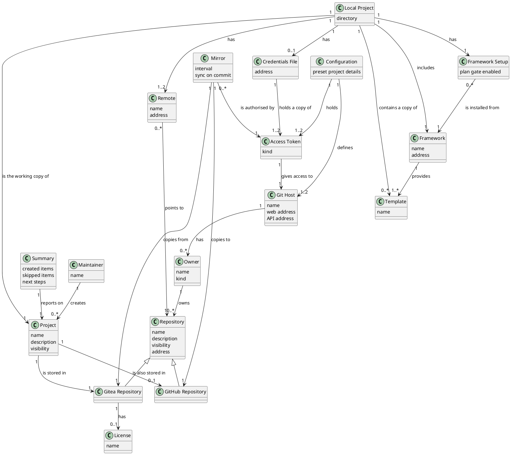

# Domain Model (UC-001)

## Metadata
| Key | Value |
| --- | --- |
| ID | DM-001 |
| CrossReference | [UC-001], [SSD-001], [DICT-001] |

## Version History
| Date | Status | Author | Reviewer | Change | Commit |
| --- | --- | --- | --- | --- | --- |
| 2026-10-05 | Deprecated | Jens Tirsvad Nielsen | S02 | Configuration may hold preset project details | [2a6bb8e] |
| 2026-10-06 | Accepted | Jens Tirsvad Nielsen | S02 | Added Credentials File (a Local Project may have one) | [ded26a6] |

---

## Purpose and Scope

Covers [UC-001] "Create a new project". The concepts come from the nouns of that use case. Concept names are the PO terms recorded in [DICT-001]; the project-level model that consolidates all use cases is [DM-002].

## Diagram

Concepts, attributes and associations only — no operations.

## Concept Table

| Concept | Definition | Attributes | Source (use case / glossary) |
| --- | --- | --- | --- |
| Maintainer | The person who creates a new project (S01 or S02) | name | [UC-001] primary actor |
| Project | The new software project being set up | name, description, visibility | [UC-001] "new project", step 3 |
| Configuration | The service addresses and access tokens the Maintainer has set up before starting, and any project details preset in it | preset project details (optional) | [UC-001] precondition, steps 2 and 3 |
| Git Host | A service that holds repositories: Gitea or GitHub | name, web address, API address | [UC-001] steps 5 to 7 "GitHub", "Gitea" |
| Access Token | A secret that lets the Maintainer act on a Git Host; it is never part of an address | kind | [UC-001] precondition "Gitea token", "GitHub PAT" |
| Owner | The user or organization on a Git Host that owns repositories | name, kind (user or organization) | [UC-001] step 3 "owner" |
| Repository | A place on a Git Host that holds a project's history | name, description, visibility, address | [UC-001] steps 5 and 6 "repository" |
| Gitea Repository | The Repository on Gitea; the source of truth | none beyond Repository | [UC-001] step 6 |
| GitHub Repository | The Repository on GitHub; receives its content from the Mirror | none beyond Repository | [UC-001] step 5 |
| License | The legal terms file added to a Gitea Repository (AGPL-3.0) when GitHub is chosen | name | [UC-001] step 6 "AGPL license" |
| Mirror | The push mirror that copies a Gitea Repository to a GitHub Repository | interval, sync on commit | [UC-001] step 7 "push mirror" |
| Local Project | The project directory on the Maintainer's machine | directory | [UC-001] step 8 "local project" |
| Remote | A named link from a Local Project to a Repository (`origin`, `github`) | name, address | [UC-001] step 8 "remote" |
| Framework | The SQA-QC-Framework added to a Local Project | name, address | [UC-001] step 9 "framework submodule" |
| Framework Setup | The skills and git hooks installed from the Framework, with the plan gate on or off | plan gate enabled | [UC-001] step 9 "skills and hooks", "plan gate" |
| Template | A file the Framework provides to copy into a project (`AGENTS.md`, artifact registry) | name | [UC-001] step 9 "templates" |
| Credentials File | The file in a Local Project that holds a copy of the Access Tokens (and the GitHub account name) the project needs; readable by its owner only and ignored by git | address | [UC-001] step 9 "credentials file" |
| Summary | The report of what was created, skipped or failed and how to continue | created items, skipped items, next steps | [UC-001] step 10 "summary" |

## Association Table

| From | Association (reading direction) | To | Multiplicity |
| --- | --- | --- | --- |
| Maintainer | creates | Project | 1 to 0..* |
| Configuration | defines | Git Host | 1 to 1..2 (GitHub is optional) |
| Configuration | holds | Access Token | 1 to 1..2 |
| Access Token | gives access to | Git Host | 1 to 1 |
| Git Host | has | Owner | 1 to 0..* |
| Owner | owns | Repository | 1 to 0..* |
| Project | is stored in | Gitea Repository | 1 to 1 |
| Project | is also stored in | GitHub Repository | 1 to 0..1 |
| Gitea Repository | has | License | 1 to 0..1 (1 when GitHub is chosen) |
| Mirror | copies from | Gitea Repository | 1 to 1 |
| Mirror | copies to | GitHub Repository | 1 to 1 |
| Mirror | is authorised by | Access Token | 0..* to 1 |
| Local Project | is the working copy of | Project | 1 to 1 |
| Local Project | has | Remote | 1 to 1..2 |
| Remote | points to | Repository | 0..* to 1 |
| Local Project | includes | Framework | 1 to 1 |
| Local Project | has | Framework Setup | 1 to 1 |
| Framework Setup | is installed from | Framework | 0..* to 1 |
| Framework | provides | Template | 1 to 1..* |
| Local Project | contains a copy of | Template | 1 to 0..* |
| Local Project | has | Credentials File | 1 to 0..1 |
| Credentials File | holds a copy of | Access Token | 1 to 1..2 |
| Summary | reports on | Project | 1 to 1 |

## Generalizations

| General | Specializations | Is-a justification |
| --- | --- | --- |
| Repository | Gitea Repository, GitHub Repository | Each is a Repository with the same name, visibility and owner rules; they differ in role (source of truth against mirror target) |

---

[UC-001]: ./uc.md
[SSD-001]: ./ssd.md
[DICT-001]: ../dictionary.md
[DM-002]: ../domain-model.md
[2a6bb8e]: https://git.tirsystem.com/TirSystem-BashScript/repo_foundry/commit/2a6bb8e8afadfe6ca4a621da30e44a372898ca62
[ded26a6]: https://git.tirsystem.com/TirSystem-BashScript/repo_foundry/commit/ded26a658c666bf29d84093cb352e3635e07719b
