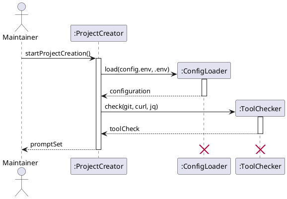
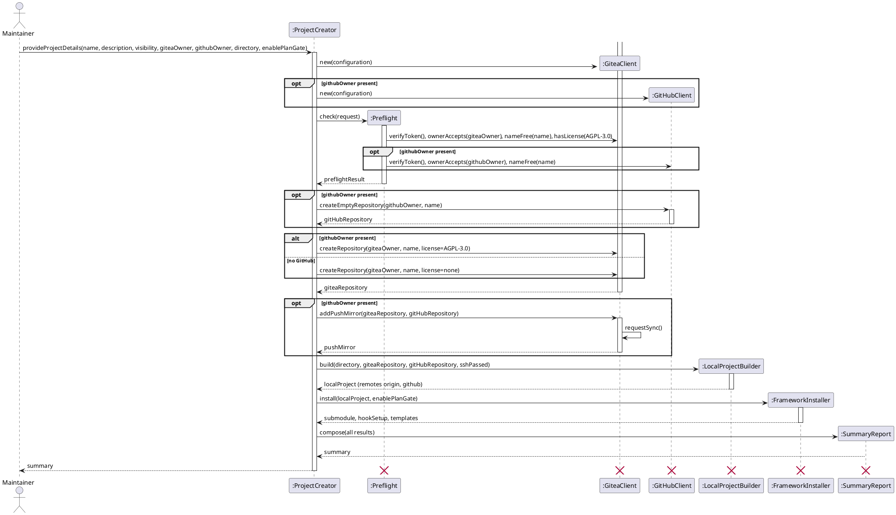

# Sequence Diagram

## Metadata
| Key | Value |
| --- | --- |
| ID | SD-001 |
| CrossReference | [OC-001] |

## Version History
| Date | Status | Author | Reviewer | Change | Commit |
| --- | --- | --- | --- | --- | --- |
| 2026-10-05 | Accepted | Jens Tirsvad Nielsen | S02 | Initial version | pending |

---

Design objects are conceptual; in `create-project.sh` each becomes a small function group. No Design Class Diagram exists yet.

## Sequence: startProjectCreation

**Realizes:** `startProjectCreation` in [OC-001]

### Diagram

### Pattern Annotations

| Pattern (GRASP / GoF) | Applied to | Rationale |
| --- | --- | --- |
| Controller (GRASP) | `ProjectCreator` | Receives the system operations and coordinates, without doing the work itself |
| Pure Fabrication (GRASP) | `ConfigLoader`, `ToolChecker` | No domain concept owns parsing or tool checks; separate small units keep cohesion high |
| Creator (GRASP) | `ConfigLoader` creates `Configuration` | It holds the data needed to build and validate it |

### Postcondition Coverage

| Postcondition (from contract) | Satisfied by message |
| --- | --- |
| P1 Run created | `startProjectCreation` received by `ProjectCreator` |
| P2 Configuration created and validated | `load(config.env, .env)` |
| P3 ToolCheck created | `check(git, curl, jq)` |
| P4 PromptSet returned | `promptSet` return to the Maintainer |

### Responsibility Check

`ProjectCreator` only sequences two calls; parsing and validation sit in `ConfigLoader`, tool detection in `ToolChecker`. No object receives every message.

## Sequence: provideProjectDetails

**Realizes:** `provideProjectDetails` in [OC-001]

### Diagram

### Pattern Annotations

| Pattern (GRASP / GoF) | Applied to | Rationale |
| --- | --- | --- |
| Controller (GRASP) | `ProjectCreator` | Single entry for the system operation; sequences the steps and stops on the first failure |
| Pure Fabrication (GRASP) | `Preflight`, `LocalProjectBuilder`, `FrameworkInstaller`, `SummaryReport` | Each groups one responsibility that no domain concept owns |
| Facade (GoF) | `GiteaClient`, `GitHubClient` | Hide each host's HTTP API and credential handling behind a small interface; tokens never leave them |
| Protection from variations (GRASP) | Client classes | The `github`-optional and license variations are decided by the controller's `alt` and `opt`, not inside the clients |

### Postcondition Coverage

| Postcondition (from contract) | Satisfied by message |
| --- | --- |
| P1 ProjectRequest created | `provideProjectDetails` received by `ProjectCreator` |
| P2 PreflightResult created | `check(request)` |
| P3 GiteaRepository created | `createRepository(giteaOwner, name, license)` |
| P4 LicenseFile when GitHub chosen, otherwise empty | `createRepository(..., license=AGPL-3.0)` and the `alt` branch `license=none` |
| P5 empty GitHubRepository when chosen | `createEmptyRepository(githubOwner, name)` |
| P6 PushMirror and first sync | `addPushMirror(...)` and `requestSync()` |
| P7 LocalProject created, history from Gitea when not empty | `build(directory, ...)` |
| P8 origin remote (SSH if the test passed, else HTTPS) | `build(..., sshPassed)` |
| P9 github remote when chosen | `build(...)` |
| P10 framework Submodule | `install(localProject, ...)` |
| P11 HookSetup, plan gate if chosen | `install(localProject, enablePlanGate)` |
| P12 AGENTS.md and registry copied or kept | `install(...)` returning `templates` |
| P13 Summary created and returned | `compose(all results)` and the final return |

### Responsibility Check

`ProjectCreator` sequences and decides on the optional paths but performs no HTTP, git or file work. Host calls are in the two clients, local work in `LocalProjectBuilder` and `FrameworkInstaller`, reporting in `SummaryReport`, so cohesion stays high and no object receives all messages. Failure handling (exceptions in [OC-001]) is the controller's single stop-and-report rule and is not drawn.

---

[OC-001]: ./oc.md
