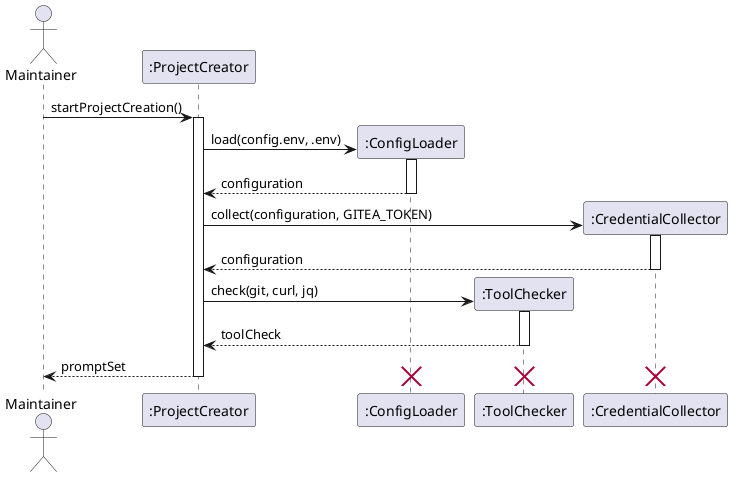
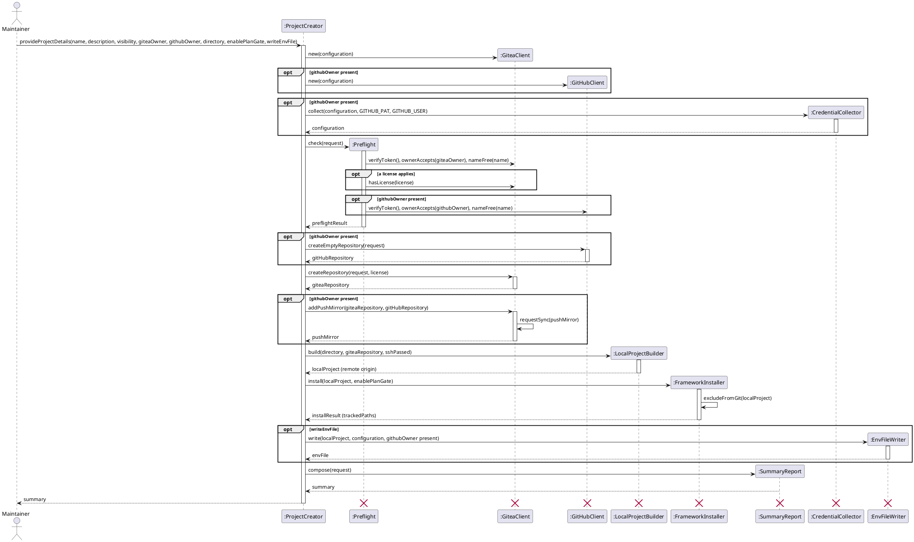

# Sequence Diagram

## Metadata
| Key | Value |
| --- | --- |
| ID | SD-001 |
| CrossReference | [OC-001], [DCD-001] |

## Version History
| Date | Status | Author | Reviewer | Change | Commit |
| --- | --- | --- | --- | --- | --- |
| 2026-10-08 | Accepted | Jens Tirsvad Nielsen | S02 | build() no longer receives the GitHub repository and returns a local project with the remote origin; P9 (MIL-008) | [039a28c] |
| 2026-10-08 | Proposed | Jens Tirsvad Nielsen | S02 | install() excludes the installed files from git with excludeFromGit() and returns the tracked paths; P15 (MIL-009) | [08cb484] |

---

Note: since [UC-002] the message `startProjectCreation` carries the working folder and the chosen configuration files ([SD-002]); [DCD-002] gives the current signature and supersedes the one shown here. This document stays the scoped view of [UC-001].

Design objects are conceptual; in `create-project.sh` each becomes a small function group. [DCD-001] gives each object its class and turns each message below into a method signature.

## Sequence: startProjectCreation

**Realizes:** `startProjectCreation` in [OC-001]

### Diagram

### Pattern Annotations

| Pattern (GRASP / GoF) | Applied to | Rationale |
| --- | --- | --- |
| Controller (GRASP) | `ProjectCreator` | Receives the system operations and coordinates, without doing the work itself |
| Pure Fabrication (GRASP) | `ConfigLoader`, `ToolChecker`, `CredentialCollector` | No domain concept owns parsing, tool checks or asking for a credential; separate small units keep cohesion high |
| Creator (GRASP) | `ConfigLoader` creates `Configuration` | It holds the data needed to build and validate it |

### Postcondition Coverage

| Postcondition (from contract) | Satisfied by message |
| --- | --- |
| P1 Run created | `startProjectCreation` received by `ProjectCreator` |
| P2 Configuration created and validated; a missing credential entered, validated and held in memory | `load(config.env, .env)` and `collect(configuration, GITEA_TOKEN)` |
| P3 ToolCheck created | `check(git, curl, jq)` |
| P4 PromptSet returned | `promptSet` return to the Maintainer |

### Responsibility Check

`ProjectCreator` only sequences three calls; parsing and validation sit in `ConfigLoader`, asking for a missing credential in `CredentialCollector`, tool detection in `ToolChecker`. No object receives every message. Project details preset in `config.env` are read and validated by `ConfigLoader` as part of `configuration`; the second sequence is unchanged, because `provideProjectDetails` receives the same arguments whether they were asked or preset.

## Sequence: provideProjectDetails

**Realizes:** `provideProjectDetails` in [OC-001]

### Diagram

### Pattern Annotations

| Pattern (GRASP / GoF) | Applied to | Rationale |
| --- | --- | --- |
| Controller (GRASP) | `ProjectCreator` | Single entry for the system operation; sequences the steps and stops on the first failure |
| Pure Fabrication (GRASP) | `Preflight`, `LocalProjectBuilder`, `FrameworkInstaller`, `SummaryReport`, `CredentialCollector`, `EnvFileWriter` | Each groups one responsibility that no domain concept owns |
| Facade (GoF) | `GiteaClient`, `GitHubClient` | Hide each host's HTTP API and credential handling behind a small interface; tokens never leave them |
| Protection from variations (GRASP) | Client classes | The `github`-optional and license variations are decided by the controller's `alt` and `opt`, not inside the clients |

### Postcondition Coverage

| Postcondition (from contract) | Satisfied by message |
| --- | --- |
| P1 ProjectRequest created | `provideProjectDetails` received by `ProjectCreator` |
| P2 PreflightResult created, including that the license is offered | `check(request)` and `hasLicense(license)` |
| P3 GiteaRepository created | `createRepository(request, license)` |
| P4 LicenseFile when a license applies, otherwise empty | `createRepository(request, license)`; `license` is the one the `ProjectRequest` carries (`PROJECT_LICENSE`, or AGPL-3.0 when GitHub was chosen and the project is public), and is absent for `none` |
| P2 GitHub credentials known before the first request | `collect(configuration, GITHUB_PAT, GITHUB_USER)` inside `opt githubOwner present` |
| P5 empty GitHubRepository when chosen | `createEmptyRepository(request)` |
| P6 PushMirror and first sync | `addPushMirror(...)` and `requestSync(pushMirror)` |
| P7 LocalProject created, history from Gitea when not empty | `build(directory, ...)` |
| P8 origin remote (SSH if the test passed, else HTTPS) | `build(..., sshPassed)` |
| P9 no other remote (GitHub is reached through the mirror) | `build(...)` adds `origin` only |
| P10 framework Submodule | `install(localProject, ...)` |
| P11 HookSetup, plan gate if chosen | `install(localProject, enablePlanGate)` |
| P12 AGENTS.md and registry copied or kept | `install(...)` returning `templates` |
| P13 Summary created and returned | `compose(request)` and the final return |
| P14 EnvFile created with the needed credentials, owner-only, ignored by git, or none when declined | `write(localProject, configuration, githubOwner present)` inside `opt writeEnvFile` |
| P15 `.claude`, `.agents` and `AGENTS.md` excluded from git; a tracked path reported | `excludeFromGit(localProject)` inside `install(...)`, and `installResult (trackedPaths)` for the `Summary` |

### Responsibility Check

`ProjectCreator` sequences and decides on the optional paths but performs no HTTP, git or file work. Host calls are in the two clients, local work in `LocalProjectBuilder` and `FrameworkInstaller`, the credential prompts in `CredentialCollector`, the `.env` in `EnvFileWriter`, reporting in `SummaryReport`, so cohesion stays high and no object receives all messages. Failure handling (exceptions in [OC-001]) is the controller's single stop-and-report rule and is not drawn.

---

[OC-001]: ./oc.md
[DCD-001]: ./dcd.md
[SD-002]: ../uc-002/sd.md
[DCD-002]: ../dcd.md
[UC-002]: ../uc-002/uc.md
[039a28c]: https://git.tirsystem.com/TirSystem-BashScript/repo_foundry/commit/039a28c01b56f8cf0af73f55d1a604b43d67ba03
[08cb484]: https://git.tirsystem.com/TirSystem-BashScript/RepoFoundry/commit/08cb484498bab3d9480decda9df89e9564438185
