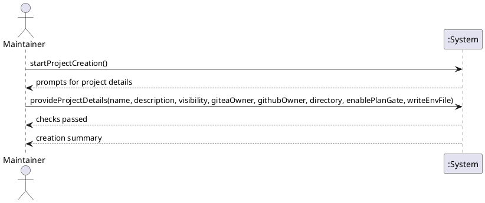

# System Sequence Diagram

## Metadata
| Key | Value |
| --- | --- |
| ID | SSD-001 |
| CrossReference | [UC-001], [DM-001], [OC-001] |

## Version History
| Date | Status | Author | Reviewer | Change | Commit |
| --- | --- | --- | --- | --- | --- |
| 2026-10-05 | Deprecated | Jens Tirsvad Nielsen | S02 | Parameters may come from config.env; the message is unchanged | [2a6bb8e] |
| 2026-10-06 | Accepted | Jens Tirsvad Nielsen | S02 | writeEnvFile parameter and the credentials that .env does not provide | [ded26a6] |

---

## Source Use Case

Create a new project ([UC-001]) — scenario: main success scenario

## Diagram

## System Operations

| Step | Message | Parameters | Return | Use case step |
| --- | --- | --- | --- | --- |
| 1 | startProjectCreation | none | prompts for project details (after configuration and tool checks; a missing credential is asked first) | 1, 2 |
| 2 | provideProjectDetails | name, description, visibility, giteaOwner, githubOwner (optional; given means GitHub is chosen and the Gitea repository gets the AGPL license; omitted means no GitHub and no license), directory, enablePlanGate (each of these may come from `config.env` instead of the Maintainer; the message is unchanged), writeEnvFile (whether to create the project's `.env`), and the credentials that `.env` does not provide (GitHub ones only when GitHub is chosen) | checks passed, then a creation summary | 3 to 10 |

Steps 4 to 9 are internal to the system, so one operation covers them. A consent question (step 8a, 9a, 9b) is a prompt from the system and is out of scope for this diagram; failure flows are out of scope here.

## Lifecycle Notes

The system is one script run. It starts with the first operation and ends after the summary; nothing persists between runs except the `.env` the Maintainer agreed to in the new project.

---

[UC-001]: ./uc.md
[DM-001]: ./dm.md
[OC-001]: ./oc.md
[2a6bb8e]: https://git.tirsystem.com/TirSystem-BashScript/repo_foundry/commit/2a6bb8e8afadfe6ca4a621da30e44a372898ca62
[ded26a6]: https://git.tirsystem.com/TirSystem-BashScript/repo_foundry/commit/ded26a658c666bf29d84093cb352e3635e07719b
