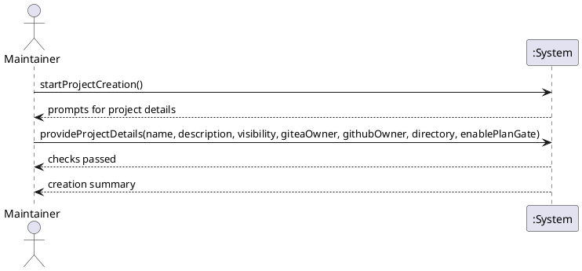

# System Sequence Diagram

## Metadata
| Key | Value |
| --- | --- |
| ID | SSD-001 |
| CrossReference | [UC-001], [DM-001], [OC-001] |

## Version History
| Date | Status | Author | Reviewer | Change | Commit |
| --- | --- | --- | --- | --- | --- |
| 2026-10-05 | Rejected | Jens Tirsvad Nielsen | S02 | Initial version | [424f14f] |
| 2026-10-05 | Accepted | Jens Tirsvad Nielsen | S02 | Optional GitHub; choosing GitHub applies the AGPL license to the Gitea repository Cited OC-001 and DM-001 | pending |

---

## Source Use Case

Create a new project ([UC-001]) — scenario: main success scenario

## Diagram

## System Operations

| Step | Message | Parameters | Return | Use case step |
| --- | --- | --- | --- | --- |
| 1 | startProjectCreation | none | prompts for project details (after configuration and tool checks) | 1, 2 |
| 2 | provideProjectDetails | name, description, visibility, giteaOwner, githubOwner (optional; given means GitHub is chosen and the Gitea repository gets the AGPL license; omitted means no GitHub and no license), directory, enablePlanGate | checks passed, then a creation summary | 3 to 10 |

Steps 4 to 9 are internal to the system, so one operation covers them. A consent question (step 8a, 9a, 9b) is a prompt from the system and is out of scope for this diagram; failure flows are out of scope here.

## Lifecycle Notes

The system is one script run. It starts with the first operation and ends after the summary; nothing persists between runs.

---

[UC-001]: ./uc.md
[DM-001]: ./dm.md
[OC-001]: ./oc.md
[424f14f]: https://git.tirsystem.com/TirSystem-BashScript/repo_foundry/commit/424f14f4f5577bb47fea41c8f3a655dca953e6d8
