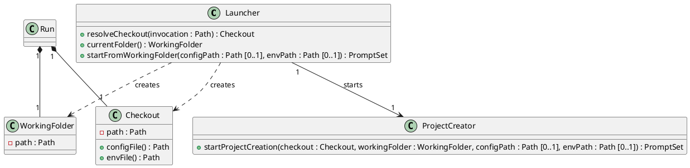

# Design Class Diagram

## Metadata
| Key | Value |
| --- | --- |
| ID | DCD-003 |
| CrossReference | [DM-003], [SD-002], [DICT-001], [UC-002], [DCD-001] |

## Version History
| Date | Status | Author | Reviewer | Change | Commit |
| --- | --- | --- | --- | --- | --- |
| 2026-10-07 | Proposed | Jens Tirsvad Nielsen | S02 | Initial version | pending |

---

## Purpose and Scope

Covers [UC-002]. Adds the classes that start the script through a command link. `ProjectCreator`, `Configuration` and `Run` are the classes of [DCD-001] and change only as stated under Method Traceability. The consolidated diagram is [DCD-002].

## Diagram

## Class Table

| Class | Refines (Domain Model concept) | Responsibility | Attributes | Operations |
| --- | --- | --- | --- | --- |
| `Launcher` | Command Link (the object that follows it) | Follows the command link to the checkout, takes the folder the Maintainer stands in, and starts the run. | none | `resolveCheckout`, `currentFolder`, `startFromWorkingFolder` |
| `Checkout` | Checkout | Names the folder that holds the script's own files and the default `config.env` and `.env`. | `path` | `configFile`, `envFile` |
| `WorkingFolder` | Working Folder | Names the base of the default directory of the new project. | `path` | none |

The concept Command Link has no class: it is a link the Maintainer makes with the shell, and the system only follows it.

## Method Traceability

| Method signature | Operation Contract / SD message |
| --- | --- |
| `Launcher.startFromWorkingFolder(configPath, envPath) : PromptSet` | [SD-002] `startFromWorkingFolder`; P1, P6 |
| `Launcher.resolveCheckout(invocation) : Checkout` | [SD-002] `resolveCheckout(invocation)`; P2 |
| `Launcher.currentFolder() : WorkingFolder` | [SD-002] `currentFolder()`; P3 |
| `Checkout.configFile() : Path`, `Checkout.envFile() : Path` | [SD-002] `startProjectCreation`; P5 |
| `ProjectCreator.startProjectCreation(checkout, workingFolder, configPath, envPath) : PromptSet` | [SD-002] `startProjectCreation`; P4, P5, P6. Replaces the signature of [DCD-001] by adding `checkout`, `workingFolder`, `configPath` and `envPath` |

## Pattern Annotations

| Pattern | Classes | Rationale |
| --- | --- | --- |
| Controller | `Launcher` | One class takes the system operation of [UC-002] |
| Information Expert | `Launcher`, `Checkout` | The launcher knows the invocation; the checkout knows where its files are |

## Dependency Check

`Launcher` depends on `ProjectCreator`, `Checkout` and `WorkingFolder`; none of them depends on `Launcher`, so no cycle is added.

---

[DM-003]: ./dm.md
[SD-002]: ./sd.md
[DICT-001]: ../dictionary.md
[UC-002]: ./uc.md
[DCD-001]: ../uc-001/dcd.md
[DCD-002]: ../dcd.md
