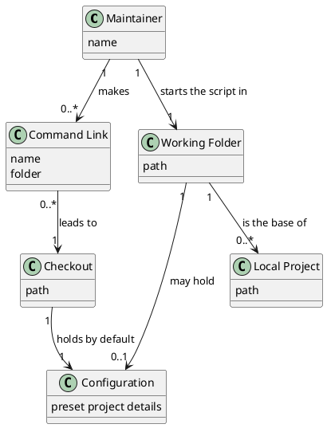

# Domain Model

## Metadata
| Key | Value |
| --- | --- |
| ID | DM-003 |
| CrossReference | [UC-002], [UCD-001], [SSD-002], [DICT-001], [DM-001] |

## Version History
| Date | Status | Author | Reviewer | Change | Commit |
| --- | --- | --- | --- | --- | --- |
| 2026-10-07 | Proposed | Jens Tirsvad Nielsen | S02 | Initial version | [1cd27f7] |
| 2026-10-07 | Proposed | Jens Tirsvad Nielsen | S02 | Default configuration files: --config and --env, else ./config.env and ./.env in the working folder, else the checkout's | pending |

---

## Purpose and Scope

Covers [UC-002] "Start the script as a global command". The concepts come from the nouns of that use case and use the PO terms of [DICT-001]. The concepts `Maintainer`, `Configuration`, `Project` and `Local Project` are those of [DM-001] and are not redefined here. The project-level model that consolidates all use cases is [DM-002].

## Diagram

Concepts, attributes and associations only — no operations.

## Concept Table

| Concept | Definition | Attributes | Source (use case / glossary) |
| --- | --- | --- | --- |
| Command Link | A name in a folder on the shell's search path that leads to the script in the checkout | name, folder | [UC-002] step 1 "command link" |
| Checkout | The folder that holds RepoFoundry: the script, its own files and by default `config.env` and `.env` | path | [UC-002] step 4 "checkout" |
| Working Folder | The folder in which the Maintainer starts the script, under which the new project is created by default, and which may hold its own `config.env` and `.env` | path | [UC-002] step 2 "working folder" |

## Association Table

| From | Association (reading direction) | To | Multiplicity |
| --- | --- | --- | --- |
| Maintainer | makes | Command Link | 1 to 0..* |
| Command Link | leads to | Checkout | 0..* to 1 |
| Maintainer | starts the script in | Working Folder | 1 to 1 |
| Checkout | holds by default | Configuration | 1 to 1 |
| Working Folder | may hold | Configuration | 1 to 0..1 |
| Working Folder | is the base of | Local Project | 1 to 0..* |

## Generalizations

| General | Specializations | Is-a justification |
| --- | --- | --- |
| None | - | - |

---

[UC-002]: ./uc.md
[UCD-001]: ../use-case-diagram.md
[SSD-002]: ./ssd.md
[DICT-001]: ../dictionary.md
[DM-001]: ../uc-001/dm.md
[DM-002]: ../domain-model.md
[1cd27f7]: https://git.tirsystem.com/TirSystem-BashScript/repo_foundry/commit/1cd27f77ed844773a969210a11de0d8bb98ac98f
