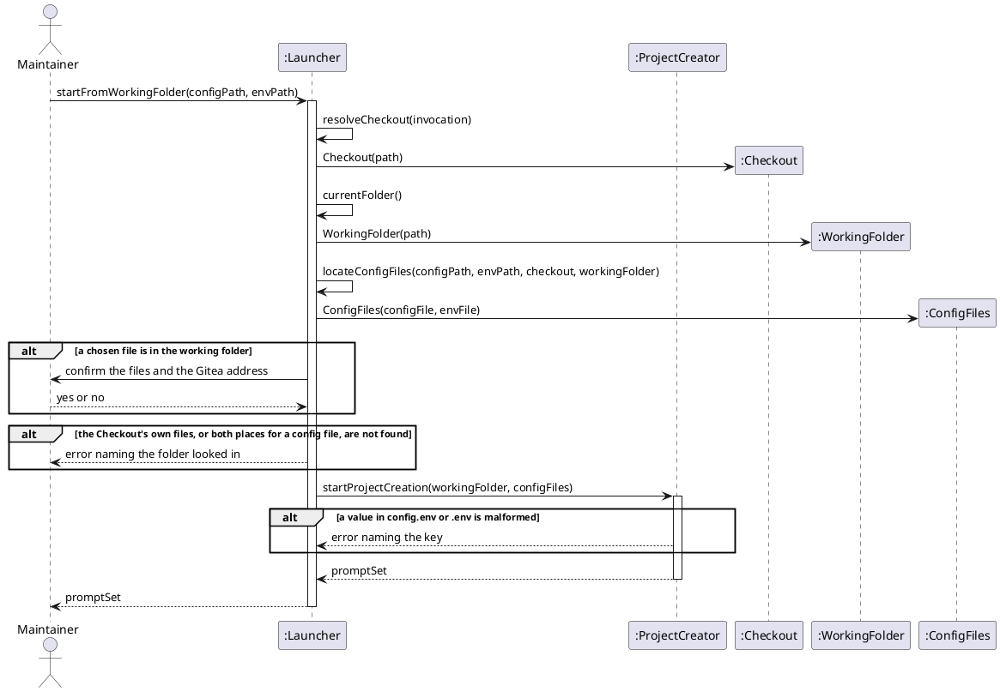

# Sequence Diagram

## Metadata
| Key | Value |
| --- | --- |
| ID | SD-002 |
| CrossReference | [OC-002], [DCD-003], [DICT-001] |

## Version History
| Date | Status | Author | Reviewer | Change | Commit |
| --- | --- | --- | --- | --- | --- |
| 2026-10-07 | Proposed | Jens Tirsvad Nielsen | S02 | Initial version | [1cd27f7] |
| 2026-10-07 | Proposed | Jens Tirsvad Nielsen | S02 | Default configuration files: --config and --env, else ./config.env and ./.env in the working folder, else the checkout's | pending |

---

Design objects are conceptual; in `create-project.sh` each becomes a small function group. [DCD-003] gives each object its class and turns each message below into a method signature. `ProjectCreator` and `ConfigLoader` are the design objects of [SD-001].

## Sequence: startFromWorkingFolder

**Realizes:** `startFromWorkingFolder` in [OC-002]

### Diagram

### Pattern Annotations

| Pattern (GRASP / GoF) | Applied to | Rationale |
| --- | --- | --- |
| Information Expert | `Launcher.resolveCheckout`, `Launcher.locateConfigFiles` | The launcher knows how the script was invoked, so it is the one that can follow the command link |
| Controller | `Launcher` | One object takes the system operation and hands the work to `ProjectCreator`; `ProjectCreator` stays unaware of links |
| Low Coupling | `ProjectCreator` receives `workingFolder` and `configFiles` as values | The use case [UC-001] runs unchanged whatever way the script was started |

### Postcondition Coverage

| Postcondition (from contract) | Satisfied by message |
| --- | --- |
| P1 Run | `startFromWorkingFolder` (the run starts with it) |
| P2 Checkout | `resolveCheckout(invocation)` and the creation of `Checkout` |
| P3 WorkingFolder | `currentFolder()` and the creation of `WorkingFolder` |
| P4 default directory under the WorkingFolder | `startProjectCreation(workingFolder, configFiles)`; the prompt default is built from `workingFolder` |
| P5 ConfigFiles | `locateConfigFiles(...)` and the creation of `ConfigFiles`; the paths are named before any request |
| P6 Configuration | `startProjectCreation(workingFolder, configFiles)` loads the two files (`load` of [SD-001]) |
| P7 PromptSet | the returned `promptSet` |
| Exceptions: files not found, not confirmed, or malformed | the `alt` fragments |

### Responsibility Check

`Launcher` only finds the checkout, the working folder and the two files; it reads no configuration and makes no repository. `ProjectCreator` keeps every other responsibility of [SD-001].

---

[OC-002]: ./oc.md
[DCD-003]: ./dcd.md
[DICT-001]: ../dictionary.md
[SD-001]: ../uc-001/sd.md
[1cd27f7]: https://git.tirsystem.com/TirSystem-BashScript/repo_foundry/commit/1cd27f77ed844773a969210a11de0d8bb98ac98f
