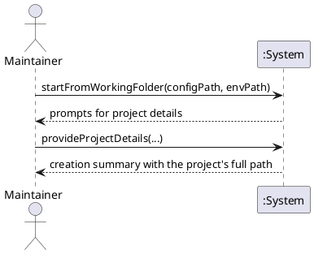

# System Sequence Diagram

## Metadata
| Key | Value |
| --- | --- |
| ID | SSD-002 |
| CrossReference | [UC-002], [DM-003] |

## Version History
| Date | Status | Author | Reviewer | Change | Commit |
| --- | --- | --- | --- | --- | --- |
| 2026-10-07 | Proposed | Jens Tirsvad Nielsen | S02 | Initial version | [1cd27f7] |

---

## Source Use Case

Start the script as a global command ([UC-002]) — scenario: main success scenario

## Diagram

## System Operations

| Step | Message | Parameters | Return | Use case step |
| --- | --- | --- | --- | --- |
| 3 to 4 | startFromWorkingFolder | configPath (optional), envPath (optional) | prompts for project details whose default directory is under the working folder | 3, 4, 5 |
| 5 | provideProjectDetails | the parameters of `provideProjectDetails` in [UC-001] | creation summary that names the full path of the new project | 5, 6 |

Failure flows (extensions 1a, 3a, 4a and 4b of [UC-002]) are out of scope for this diagram: they end the run with a message and add no system operation. `provideProjectDetails` is the operation of [UC-001] and is not repeated in [OC-002]; the only difference is the base of the default `directory`. Making the command link (step 1) and opening the shell (step 2) are done by the Maintainer outside the system, so they are not system operations.

## Lifecycle Notes

One script run, as in [UC-001]. The command link persists between runs; the system keeps no state of it.

---

[UC-002]: ./uc.md
[DM-003]: ./dm.md
[OC-002]: ./oc.md
[1cd27f7]: https://git.tirsystem.com/TirSystem-BashScript/repo_foundry/commit/1cd27f77ed844773a969210a11de0d8bb98ac98f
