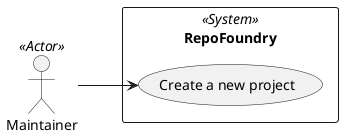

# Use Case Diagram

## Metadata
| Key | Value |
| --- | --- |
| ID | UCD-001 |
| CrossReference | [SA-001], [BC-001], [US-001], [UC-001] |

## Version History
| Date | Status | Author | Reviewer | Change | Commit |
| --- | --- | --- | --- | --- | --- |
| 2026-10-05 | Accepted | Jens Tirsvad Nielsen | S02 | Initial version | [02875ae] |

---

## Purpose and Scope

The system boundary is RepoFoundry, the `create-project.sh` script. Inside it is one goal: creating a new project. The only actor is the Maintainer. GitHub, Gitea and the framework repository are services the system calls; they are outside the boundary and are not actors, because no use case describes their goals and the Stakeholder Analysis has no stakeholder for them.

## Diagram

## Actor Table

| Actor | Stereotype | Stakeholder ID (SA) | Goals (use cases) |
| --- | --- | --- | --- |
| Maintainer | `<<Actor>>` | S01, S02 | Create a new project |

## Use Case Table

| Use Case | Actor(s) | Goal |
| --- | --- | --- |
| Create a new project ([UC-001]) | Maintainer | Start a new project with a Gitea repository, optionally a GitHub repository and mirror, and a local project with the SQA-QC-Framework |

## Relationships

| From | Relationship (`<<include>>` / `<<extend>>`) | To | Justification |
| --- | --- | --- | --- |
| None | - | - | The optional GitHub steps are steps 5 and 7 of [UC-001], not a separate goal of the Maintainer, so they are not modelled as an `<<extend>>` use case |

---

[SA-001]: ./stakeholder-analysis.md
[BC-001]: ./business-case.md
[US-001]: ./user-stories.md
[UC-001]: ./uc-001/uc.md
[02875ae]: https://git.tirsystem.com/TirSystem-BashScript/repo_foundry/commit/02875aee5f2953473924074eea0056eb31af6b7a
