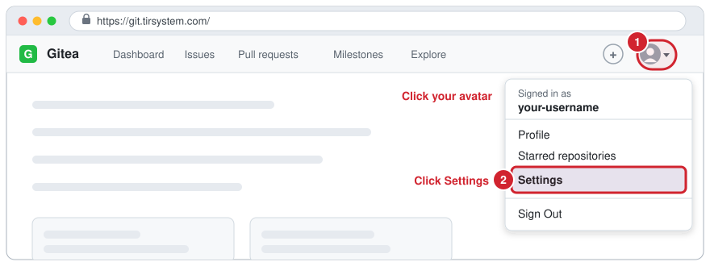
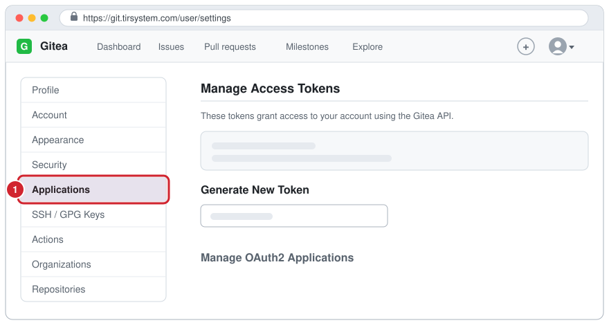
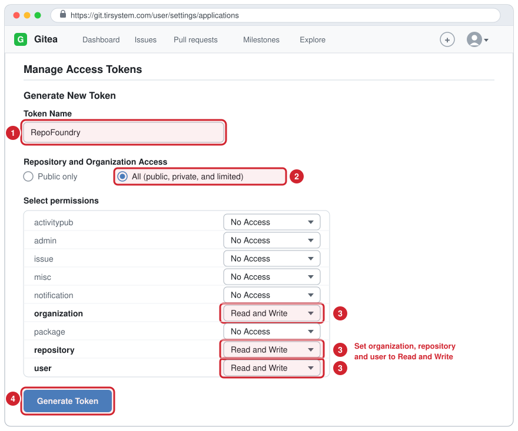
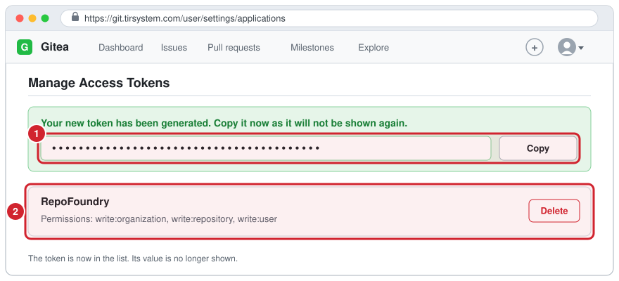
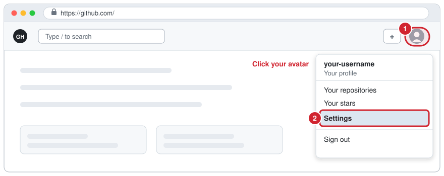
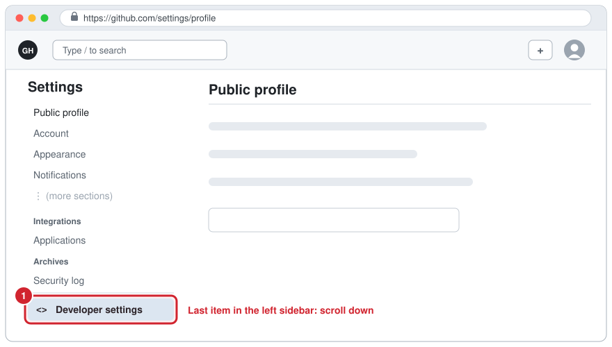
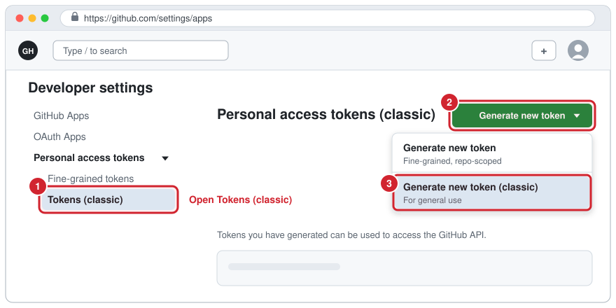
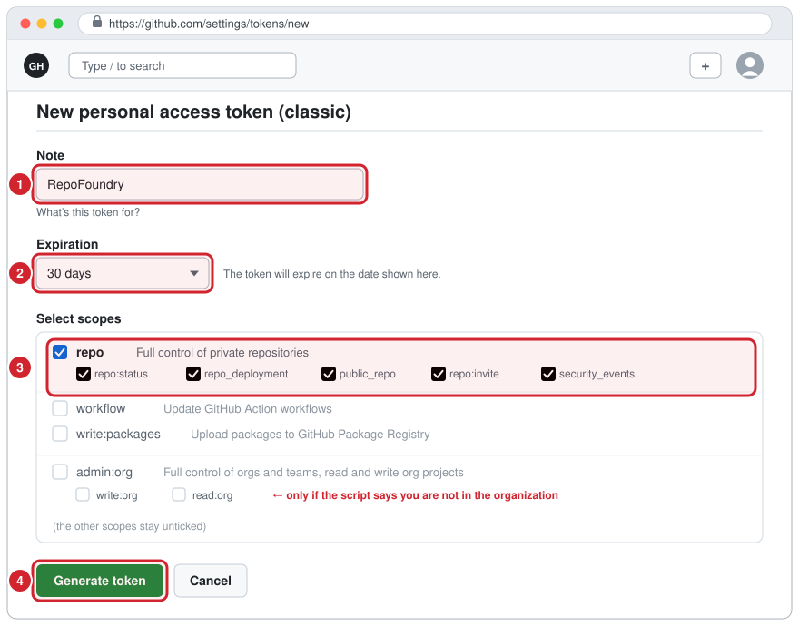
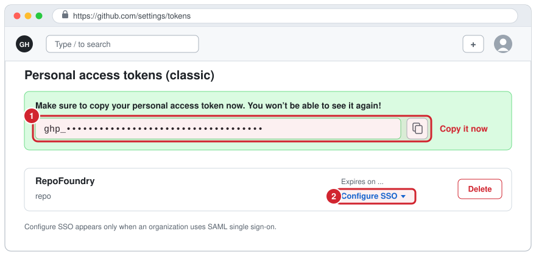

# How to create the access tokens RepoFoundry needs

RepoFoundry talks to two hosts and needs one token for each:

| Token | Key | Needed | Type |
| --- | --- | --- | --- |
| Gitea access token | `GITEA_TOKEN` | always | an access token with scopes |
| GitHub personal access token | `GITHUB_PAT` | only when you choose GitHub | a **classic** personal access token (PAT) |

This guide shows both, step by step. The red numbers in each picture match the
numbered steps next to it.

> **About the pictures.** They are drawings of the pages, not screenshots, so
> that they show no account data. Names, colors and the position of a control
> can differ a little in your version of Gitea or GitHub. The words in bold in
> the steps are the labels to look for. A new token is shown as dots in the
> pictures; on your screen you see its real value.

The full list of what each token may do is in
[Token permissions](../README.md#token-permissions) in the README. This guide
is the click-by-click version of it.

Contents:

1. [Create a Gitea access token](#1-create-a-gitea-access-token)
2. [Create a GitHub personal access token (classic)](#2-create-a-github-personal-access-token-classic)
3. [Give the tokens to RepoFoundry](#3-give-the-tokens-to-repofoundry)
4. [Keep the tokens safe](#4-keep-the-tokens-safe)
5. [If something goes wrong](#5-if-something-goes-wrong)

---

## 1. Create a Gitea access token

The examples use `https://git.tirsystem.com`. If your Gitea runs elsewhere, use
the address you set as `GITEA_URL` in `config.env`.

### Step 1. Open your settings

Sign in to Gitea. Click your **avatar** in the top-right corner (1), then
choose **Settings** (2).



### Step 2. Open "Applications"

In the menu on the left, click **Applications** (1).

You can also go straight there: `<your Gitea address>/user/settings/applications`.



### Step 3. Fill in the token form

Scroll to **Generate New Token** and fill it in:

1. **Token Name:** a name you will recognise later, for example `RepoFoundry`.
2. **Repository and Organization Access:** choose **All (public, private, and
   limited)**. A token that is limited to **Public only** cannot see private
   repositories or organizations, so creating a private project would fail.
3. **Select permissions:** set these three to **Read and Write** and leave
   every other line at **No Access**:

   | Permission | Level | Why RepoFoundry needs it |
   | --- | --- | --- |
   | `organization` | Read and Write | look up the owner and your rights in it, create repositories in an organization |
   | `repository` | Read and Write | create the repository and manage its push mirror |
   | `user` | Read and Write | read which account the token belongs to, and create a repository under **your own** account |

4. Click **Generate Token**.



> **Only creating projects in organizations?** Then `user` can stay at **Read**.
> `Read and Write` on `user` is needed only to create a repository under your
> own account; without it Gitea answers `required=[write:user]`.

### Step 4. Copy the token now

Gitea shows the new token **once**, in a green message at the top of the page
(1). Copy it (use the copy button if your version has one, or select the text
and press Ctrl+C, Cmd+C on a Mac) and keep it for
[step 3 of this guide](#3-give-the-tokens-to-repofoundry). The new token is now
in the list below it (2), with its permissions, but the list never shows its
value again.

If you lose the value, delete that token and generate a new one.



---

## 2. Create a GitHub personal access token (classic)

Skip this part when you will not create a GitHub repository (`USE_GITHUB=no` or
answering no when asked). `GITHUB_PAT` is then not needed.

Use a **classic** token. RepoFoundry has not been tested with fine-grained
tokens, because GitHub documents no fine-grained permission for creating a
repository.

### Step 1. Open your settings

Sign in to GitHub. Click your **profile picture** in the top-right corner (1),
then **Settings** (2).



### Step 2. Open "Developer settings"

In the left sidebar, scroll to the bottom and click **Developer settings** (1).
It is the last entry.



### Step 3. Choose "Tokens (classic)"

1. In the left sidebar, open **Personal access tokens** and click **Tokens
   (classic)** (1).
2. Click **Generate new token** (2).
3. In the menu that opens, choose **Generate new token (classic)** (3). Not
   the first entry, which is the fine-grained kind.

GitHub may ask you to confirm your password or a two-factor code. Do that
yourself; nobody else should type it.



> Direct address: `https://github.com/settings/tokens/new`

### Step 4. Fill in the form

1. **Note:** a name you will recognise later, for example `RepoFoundry`.
2. **Expiration:** pick a date. A shorter life limits the damage if the token
   leaks; you then create a new token when it ends.
3. **Select scopes:** tick the scopes below and nothing else.

   | Scope | Tick it when | Why |
   | --- | --- | --- |
   | `repo` | always (private or public projects) | creates the repository, and is the password Gitea uses to push the mirror |
   | `public_repo` instead of `repo` | **only** public projects | enough to create and push a public repository; ticking `repo` already includes it |
   | `read:org` | only if the script says you do not belong to your organization | lets the script check your membership of an organization owner |

   Ticking `repo` also ticks its five sub-scopes (`repo:status`,
   `repo_deployment`, `public_repo`, `repo:invite`, `security_events`); that is
   expected. Leave `workflow`, `write:packages` and the rest unticked.

4. Scroll down and click **Generate token** (4).



> **`read:org` and `admin:org`.** The README records that the check worked with
> a token that had `repo` and `admin:org`, and that `read:org` alone is
> untested. Try `read:org` first. `admin:org` gives far more power than
> RepoFoundry needs, so use it only if `read:org` is not enough.

### Step 5. Copy the token now

GitHub shows the token **once**, in a green box at the top (1). Click the copy
icon next to it. It starts with `ghp_`. Keep it for
[step 3 of this guide](#3-give-the-tokens-to-repofoundry).

If the owner of the new repository is an organization that uses SAML single
sign-on, the token must also be authorised for that organization: in the token
list click **Configure SSO** (2) next to the token and then **Authorize**
for the organization.



---

## 3. Give the tokens to RepoFoundry

Choose one way. Both keep the token out of `config.env` (a token there is
rejected).

**Option A: type it when asked (nothing is stored).** Do nothing in advance.
RepoFoundry asks for `Gitea access token` at the start, and for
`GitHub personal access token` and `GitHub account name` once you choose
GitHub. What you type is not shown on the screen. Paste only the token, with no
spaces, no line break and no quote marks.

**Option B: keep them in `.env` (convenient, plain text on disk).** In the
RepoFoundry folder:

```bash
cp .env.example .env
chmod 600 .env          # Linux and macOS: only you can read it
```

Open `.env` and fill in the values; replace the text in angle brackets and
remove the brackets:

```text
GITEA_TOKEN=<the Gitea token>
GITHUB_PAT=<the GitHub token>
GITHUB_USER=<your GitHub account name>
```

`GITHUB_PAT` and `GITHUB_USER` are needed only when you create a GitHub
repository. Git ignores `.env`. Never commit it, send it, or paste it into a
chat or an issue.

Then check the setup with a dry run, which only reads from the hosts and
creates nothing:

```bash
src/create-project.sh
```

---

## 4. Keep the tokens safe

- A token is a password. Anyone who has it can do what it allows.
- Give each token only the access in this guide, and an expiration date.
- Do not paste a token in a command line, a URL, a commit, an issue or a chat.
- If a token may have leaked, delete it at once and make a new one:
  - Gitea: **Settings**, **Applications**, then **Delete** on that token.
  - GitHub: **Settings**, **Developer settings**, **Personal access tokens**,
    **Tokens (classic)**, then **Delete** on that token.
- When a token expires, create a new one the same way and replace it in `.env`.

---

## 5. If something goes wrong

| What you see | Likely cause | What to do |
| --- | --- | --- |
| `authentication failed: the token is missing, expired or invalid` | the token was mistyped, has expired or was deleted | create a new token and use it |
| `the token is valid but not allowed to do this (check its scopes)` | a permission is missing | Gitea: set `organization`, `repository` and `user` to **Read and Write**. GitHub: tick `repo` |
| Gitea answers `required=[write:user]` | the project is being created under your own account | set `user` to **Read and Write** |
| `Gitea owner '...' is neither your account (...) nor an organization the token can see` | the token is limited to **Public only**, or the owner name is wrong | make the token **All (public, private, and limited)**, or fix the owner |
| `GitHub owner '...' is neither your account (...) nor an organization you belong to (or the token lacks the read:org scope)` | the token cannot see the organization | tick `read:org`, and authorise the token for the organization if it uses single sign-on |
| the pasted token is refused again and again | spaces, a line break or quote marks came with the paste | copy it again and paste only the token |
| `GITHUB_USER is '...' but the token belongs to '...'` | a warning: the name in `.env` is not the account of the token | no action needed; RepoFoundry uses the account the token belongs to |
